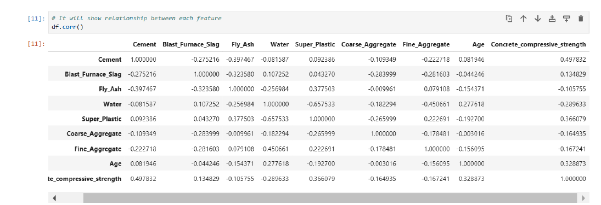
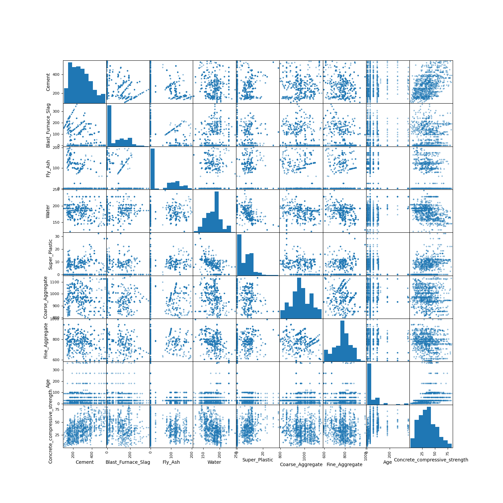

#### Concrete-Compressive-Strength-Prediction

Date Set PAth -> https://archive.ics.uci.edu/dataset/165/concrete+compressive+strength

### Project Overview
This project aims to predict the compressive strength of concrete using machine learning models. The dataset contains 1,030 observations with 9 attributes, where 8 are quantitative input variables (cement, water, fine aggregate, etc.) and 1 is the target variable (concrete compressive strength). The goal is to identify key factors that influence concrete strength and build accurate prediction models.

### Key Features
Attributes: The dataset includes cement, water, coarse aggregate, fine aggregate, age, fly ash, and other factors.
Target: Concrete compressive strength.

Machine Learning Models:
Multiple Linear Regression
Polynomial Regression

### Objective

The objective of the project is to:

Analyze the relationships between features and concrete compressive strength.
Build multiple machine learning models to predict the compressive strength.
Compare model performance and select the best model.

### Approach

Data Understanding: The dataset is first explored using correlation matrices and visualizations (e.g., scatter matrix).
Data Preparation: The dataset is split into training and testing sets for model building.
Modeling: Different machine learning models are applied and compared for their performance.
Evaluation: Model performance is evaluated using metrics such as R² and RMSE.

### Data Information
The dataset contains 1030 samples  

| idx | column                        | non-null count | dtype   |
|-----|-------------------------------|----------------|---------|
| 0   | Cement                        | 1030 non-null  | float64 |
| 1   | Blast Furnace Slag            | 1030 non-null  | float64 |
| 2   | Fly Ash                       | 1030 non-null  | float64 |
| 3   | Water                         | 1030 non-null  | float64 |
| 4   | Superplasticizer              | 1030 non-null  | float64 |
| 5   | Coarse Aggregate              | 1030 non-null  | float64 |
| 6   | Fine Aggregate                | 1030 non-null  | float64 |
| 7   | Age                           | 1030 non-null  | int64   |
| 8   | Concrete Compressive Strength | 1030 non-null  | float64 |
  

### Checking for missing values  

|       |      Cement | Blast Furnace Slag |     Fly Ash |       Water | Superplasticizer | Coarse Aggregate | Fine Aggregate |         Age | Concrete compressive strength |
|------:|------------:|-------------------:|------------:|------------:|-----------------:|-----------------:|---------------:|------------:|------------------------------:|
| count | 1030.000000 | 1030.000000        | 1030.000000 | 1030.000000 | 1030.000000      | 1030.000000      | 1030.000000    | 1030.000000 | 1030.000000                   |
|  mean | 281.167864  | 73.895825          | 54.188350   | 181.567282  | 6.204660         | 972.918932       | 773.580485     | 45.662136   | 35.817961                     |
|  std  | 104.506364  | 86.279342          | 63.997004   | 21.354219   | 5.973841         | 77.753954        | 80.175980      | 63.169912   | 16.705742                     |
|  min  | 102.000000  | 0.000000           | 0.000000    | 121.800000  | 0.000000         | 801.000000       | 594.000000     | 1.000000    | 2.330000                      |
|  25%  | 192.375000  | 0.000000           | 0.000000    | 164.900000  | 0.000000         | 932.000000       | 730.950000     | 7.000000    | 23.710000                     |
|  50%  | 272.900000  | 22.000000          | 0.000000    | 185.000000  | 6.400000         | 968.000000       | 779.500000     | 28.000000   | 34.445000                     |
|  75%  | 350.000000  | 142.950000         | 118.300000  | 192.000000  | 10.200000        | 1029.400000      | 824.000000     | 56.000000   | 46.135000                     |
|  max  | 540.000000  | 359.400000         | 200.100000  | 247.000000  | 32.200000        | 1145.000000      | 992.600000     | 365.000000  | 82.600000                     |

In some components such as *Blast Furnace Slag*, *Fly Ash*, *Superplasticizer*, the min value (minimum value in that column) contains a value of 0.
Usually, the value 0 will be considered as *missing values*, however in this project **the value 0 will be assumed that the component was not used in the mixing process**

### Data Preprocessing Steps

Loaded the dataset and handled any inconsistencies (no missing values).
Performed exploratory data analysis (EDA) to understand feature relationships.
Split the data into training and testing sets.

## Correlation Matrix
The following correlation matrix illustrates the relationships between different features in the dataset:

## Scatter Matrix
Here is the scatter matrix showing the pairwise relationships between the features:

### Models Used

Linear Regression: A basic model for capturing linear relationships.
Polynomial Regression: Enhances the model's ability to handle non-linear relationships.

### The models are evaluated based on:

R² (Coefficient of Determination): Measures how well the model explains the variance in the data.
RMSE (Root Mean Squared Error): Measures the average error in the model's predictions.
Key Findings:
Polynomial regression significantly improved model performance compared to linear regression (from 54% to 77% accuracy).

The evaluation metric used is the **root_mean_squared_error (RMSE)** loss function, implemented using the mean_squared_error loss function from sklearn and then taking the square root using numpy.sqrt(). The result is the RMSE loss function.

RMSE or Root Mean Squared Error is a loss function obtained from the process of squaring the error (y_true - y_prediction) and dividing by the count, then taking the square root.

### Dependencies

pandas
numpy
matplotlib
seaborn
scikit-learn

### Conclusion

In this project, we focused on predicting the compressive strength of concrete using machine learning techniques, specifically **Linear Regression** and **Polynomial Regression**. After thoroughly exploring the dataset and preprocessing the data, we built both models to assess their predictive capabilities.

**Key Findings:**
- **Linear Regression**: The linear regression model served as a baseline model. It provided a reasonable initial prediction but had limitations in capturing non-linear relationships within the data, resulting in a lower accuracy.
  
- **Polynomial Regression**: To improve the model’s ability to capture non-linear trends, we applied polynomial regression. This enhanced the model's performance significantly, increasing the accuracy from **54%** with linear regression to **77%**. The polynomial model was able to better capture the complexity of the relationship between the features and the target variable, thus reducing the model error and improving predictions.

### Overall Impact:
- Polynomial regression yielded a much better predictive performance than linear regression, demonstrating that some degree of non-linearity is present in the relationship between the input features and concrete compressive strength.
- The findings from this study can help in making more accurate predictions for concrete strength, which is crucial for civil engineering applications like construction and infrastructure development.

### Future Work:
- Further improvements could be made by experimenting with other machine learning models like Decision Trees or Random Forest, which might perform even better for this type of dataset.
- A deeper exploration into feature engineering and hyperparameter tuning could also be beneficial for optimizing model performance.

This study successfully demonstrated that a simple polynomial regression model can significantly improve predictive accuracy when dealing with complex relationships in concrete strength prediction.
